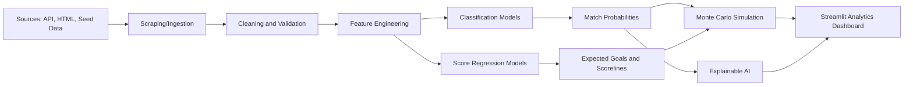

# Architecture

## Layers

- `scraping/`: API, HTML, and deterministic seed-data adapters.
- `preprocessing/`: cleaning, validation, duplicate handling, outlier clipping, and persistence.
- `feature_engineering/`: team form, Elo/ranking gaps, xG gaps, passing, possession, and derived features.
- `models/`: classification, regression, scoreline, simulation, and explainability utilities.
- `streamlit_app/`: multipage dashboard, reusable UI components, charting utilities, and data loading.

## Production Notes

The included seed data makes the portfolio runnable without paid data access. For production, add official provider keys to `.env`, extend `scraping/sources.py`, and schedule `python run_pipeline.py` daily with cron, GitHub Actions, Airflow, Prefect, or Windows Task Scheduler.
